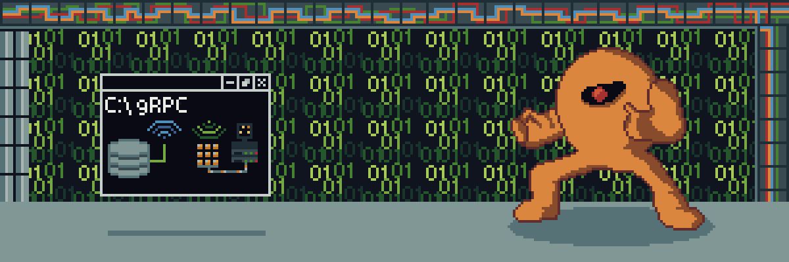

```
Feito por Ramon Couto Santos & Aaron Goldberg Guerra.
```

# Yellow Devil gRPC — Teletransporte entre terminais

#### Projeto feito para a disciplina Desenvolvimento de Sistemas Distribuídos

O Yellow Devil (Mega Man, 1987) se desintegra no terminal do cliente e é remontado,
partícula por partícula, no terminal do servidor — cada partícula é uma mensagem
gRPC transmitida por streaming. Depois ele pode ser trazido de volta, no sentido inverso.

- **Contrato:** [`YellowDevilServer/Protos/Yellow_devil.proto`](YellowDevilServer/Protos/Yellow_devil.proto)
- **Servidor:** [`YellowDevilServer/`](YellowDevilServer/) — ASP.NET Core (Grpc.AspNetCore)
- **Cliente:** [`YellowDevilClient/`](YellowDevilClient/) — console (Grpc.Net.Client)

## Requisitos

- [.NET SDK 10.0](https://dotnet.microsoft.com/download) ou superior
- Terminal com pelo menos 60 colunas por 25 linhas (Windows Terminal recomendado)

## Instalar dependências, gerar os stubs e compilar

```bash
dotnet build
```

> Um único comando faz as três coisas: restaura os pacotes NuGet, gera os stubs
> e compila. Os stubs são gerados automaticamente pelo compilador do Protocol
> Buffers (pacote `Grpc.Tools`) a partir do `.proto`, em:
>
> - `YellowDevilServer/obj/Debug/net10.0/Protos/YellowDevil.cs` — classes das mensagens
> - `YellowDevilServer/obj/Debug/net10.0/Protos/YellowDevilGrpc.cs` — classe base do serviço
> - `YellowDevilClient/obj/Debug/net10.0/YellowDevil.cs` — classes das mensagens
> - `YellowDevilClient/obj/Debug/net10.0/YellowDevilGrpc.cs` — stub do cliente

## Executar (tudo no mesmo PC)

**Terminal 1 — servidor** (gRPC em `0.0.0.0:5254`; página da sala em `0.0.0.0:5255`):

```bash
dotnet run --project YellowDevilServer
```

**Terminal 2 — cliente que começa com o monstro** (flag `boss`):

```bash
dotnet run --project YellowDevilClient -- http://localhost:5254 boss
```

**Terminal 3 — cliente vazio** (recebe o monstro quando invocar):

```bash
dotnet run --project YellowDevilClient -- http://localhost:5254
```

## Executar em PCs diferentes (mesma rede)

1. No PC servidor, descubra o IP local e libere a porta no firewall
   (PowerShell **como administrador** — só na primeira vez):

```bash
ipconfig
netsh advfirewall firewall add rule name="YellowDevil gRPC" dir=in action=allow protocol=TCP localport=5254,5255
dotnet run --project YellowDevilServer
```

2. Em cada PC cliente (clone o repositório e use o IP do servidor):

```bash
dotnet run --project YellowDevilClient -- http://192.168.0.10:5254 boss
```

> Apenas **um** cliente deve usar a flag `boss` (é ele que nasce com o monstro).
> Os demais rodam sem a flag e começam vazios.

## Modo sala de aula (navegador — sem instalar nada)

Qualquer pessoa na mesma rede (inclusive pelo celular) abre no navegador:

```
http://IP_DO_SERVIDOR:5255
```

O botão **INVOCAR O MONSTRO** puxa o Yellow Devil do servidor para a página, e
**DEVOLVER AO SERVIDOR** manda ele de volta. Não precisa de .NET, instalação nem
permissão de administrador — só o PC do servidor precisa liberar as portas no firewall.

> **Wi-Fi de instituição:** algumas redes isolam os dispositivos entre si (client
> isolation) mesmo estando na mesma rede — nesse caso ninguém alcança o IP do
> servidor. Teste com antecedência; se falhar, use o hotspot do celular do
> apresentador como rede local no dia.

## Controles (no terminal do cliente)

| Tecla | Ação |
|-------|------|
| `ENTER` (com o monstro) | Teleporta o Yellow Devil para o servidor |
| `ENTER` (sem o monstro) | Invoca o monstro do servidor — o próximo que pedir, leva |
| `sair` + `ENTER` | Encerra o cliente |

